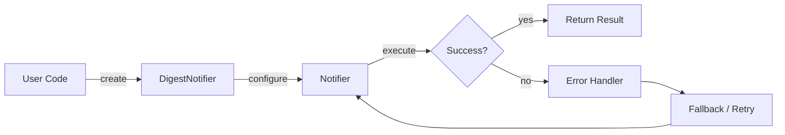
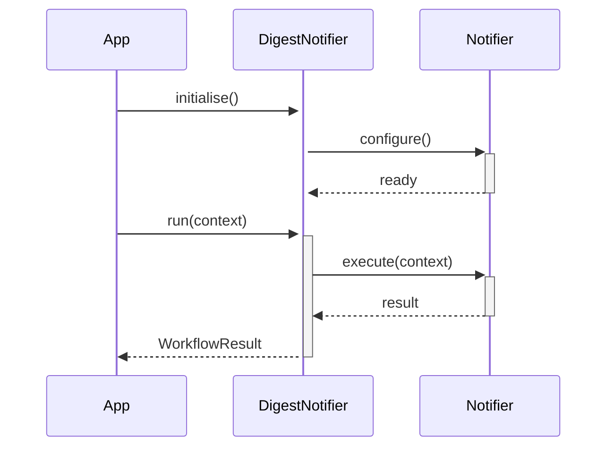

<div align="center">

</div>

# agent-notifier

**Notification dispatch for agent events: webhooks, digests, routers.**

[](https://pypi.org/project/agent-notifier/) [](https://python.org) [](LICENSE) [](#)

---

## The Problem

Without a notifier, important agent events — failures, completions, anomalies — are lost unless someone is watching the logs. Silent failures cost time; good alerts save it.

## Installation

```bash
pip install agent-notifier
```

## Quick Start

```python
from agent_notifier import DigestNotifier, Notifier, NotifierProtocol

# Initialise
instance = DigestNotifier(name="my_agent")

# Use
result = instance.run()
print(result)
```

## API Reference

### `DigestNotifier`

```python
class DigestNotifier:
    """Batches notifications; delivers them when :meth:`flush` is called.
    def __init__(self, flush_size: int = 10) -> None:
    def pending_count(self) -> int:
        """Number of buffered but un-flushed notifications."""
    def notify(self, event: str, data: dict[str, Any] | None = None) -> None:
        """Buffer *event* + *data*.
    def flush(self) -> list[dict[str, Any]]:
        """Return all buffered notifications and clear the buffer."""
```

### `Notifier`

```python
class Notifier:
    """Base notification dispatcher.
    def __init__(self, name: str) -> None:
    def subscribe(self, event: str, handler: Callable) -> None:
        """Register *handler* for *event*."""
    def unsubscribe(self, event: str, handler: Callable) -> None:
        """Remove *handler* from *event*.  No-op if not registered."""
    def notify(self, event: str, data: dict | None = None) -> None:
        """Fire all handlers registered for *event*."""
```

### `NotifierProtocol`

```python
class NotifierProtocol(Protocol):
    """Anything with a ``notify(event, data)`` method qualifies."""
    def notify(self, event: str, data: dict | None = None) -> None: ...  # noqa: E704
```

### `NotificationRouter`

```python
class NotificationRouter:
    """Routes events to notifiers based on glob patterns.
    def __init__(self) -> None:
    def register(self, event_pattern: str, notifier: NotifierProtocol) -> None:
        """Map *event_pattern* (glob) to *notifier*.
    def dispatch(self, event: str, data: dict[str, Any] | None = None) -> None:
        """Send *event* to every notifier whose pattern matches."""
```


## How It Works

### Flow



### Sequence



## Philosophy

> *Dūta* — the divine messenger — is the original notification system; alerts carry dharma across distances.

---

*Part of the [arsenal](https://github.com/darshjme/arsenal) — production stack for LLM agents.*

*Built by [Darshankumar Joshi](https://github.com/darshjme), Gujarat, India.*
